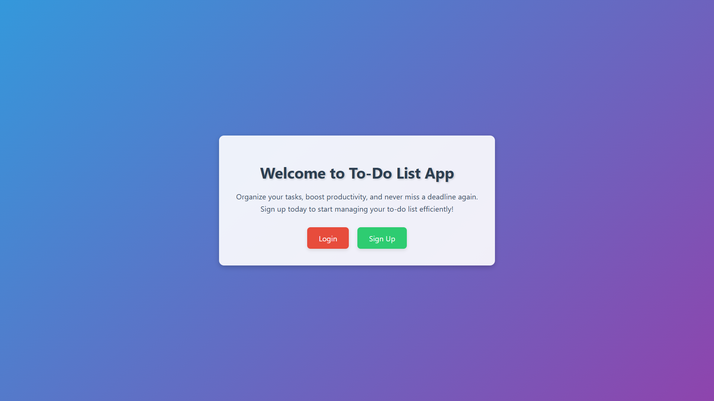
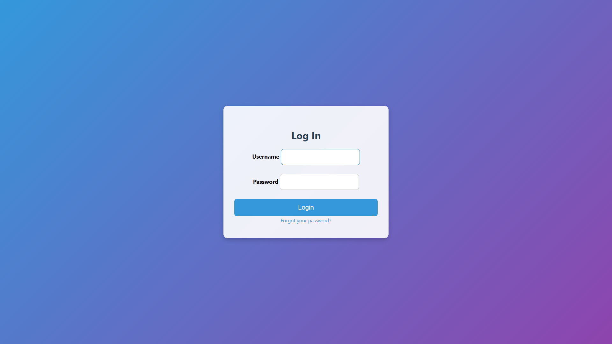
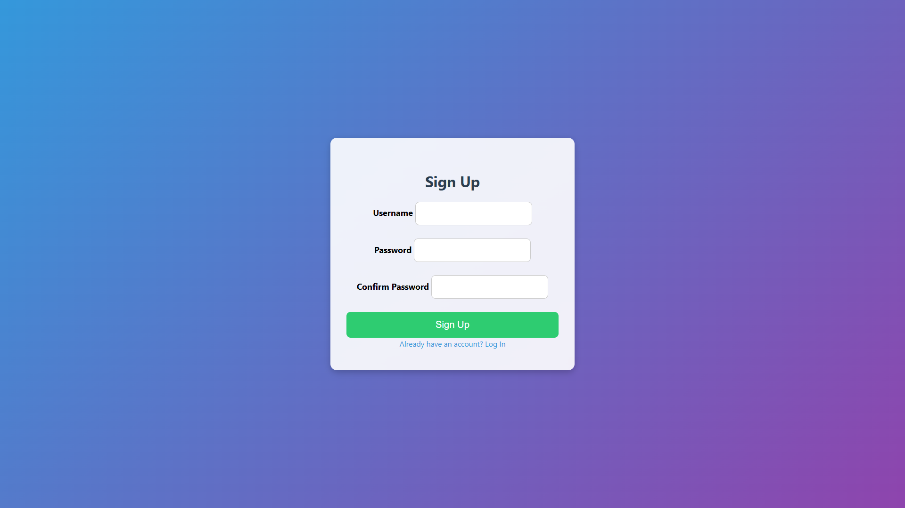
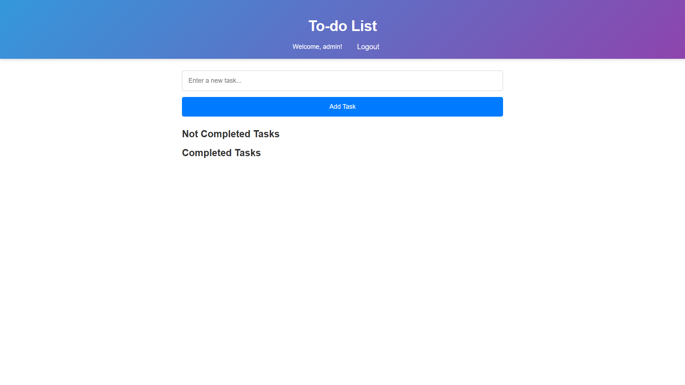
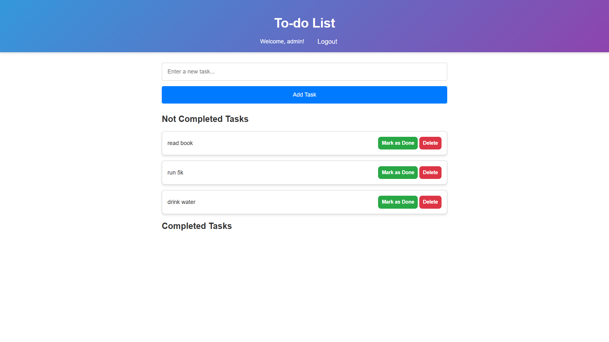

# 📝 TodoList Web Application

A TodoList web application built with **Django** that allows users to manage their daily tasks efficiently.  
The application is **containerized using Docker** and uses **PostgreSQL as the database** with **Nginx as a reverse proxy**.

---

# 🚀 Features

### Authentication
- User registration
- User login
- User logout

### Task Management
- Create new tasks
- Delete tasks
- Mark tasks as completed

### Completed Tasks
- When a task is marked as completed, it is automatically moved to the **Completed Tasks** section.
- Users can easily track tasks that have already been finished.

---

# 🛠 Tech Stack

Backend:
- Django
- Python 3.11

Database:
- SQLite

Containerization:
- Docker
- Docker Compose

---

# 📦 Containerized Architecture

The application runs using multiple Docker containers:

# Databse schema
CustomUser
-----------
id (PK)
username
password
is_active
is_staff
is_superuser

        │
        │ 1
        │
        ▼

Task
-----------
id (PK)
title
status
created_at
updated_at
user_id (FK)

# Demo

### Welcome Page

### Login Page

### Signup Page

### Main View

### Add task View

### Completed Tasks
